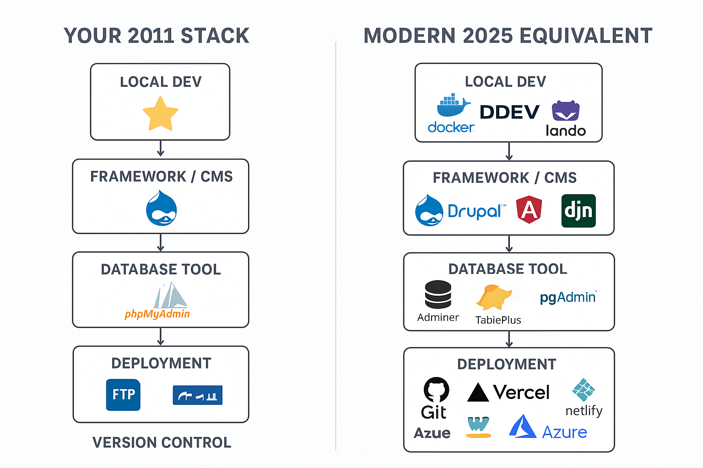

In 2011, the typical stack for freelance/client projects looked a lot like what you described:

## WAMP / XAMPP

WAMP = Windows, Apache, MySQL, PHP

XAMPP = Cross-platform version (Windows/Linux/Mac)

These were super popular because most small client websites ran on PHP + MySQL.

They let you develop locally on your PC, then FTP the files to a hosting server.

🔹 Drupal (and other CMS)

Drupal, Joomla, WordPress were the go-to CMSs in 2010–2012.

They were written in PHP, easy to host on cheap shared hosting (like GoDaddy, HostGator, Bluehost).

You’d mostly deploy via cPanel + phpMyAdmin + FTP.

## Workflow in 2011

Since GitHub/Bitbucket/GitLab weren’t mainstream yet for freelancers, most people did:

Develop locally with WAMP/XAMPP

Export MySQL database with phpMyAdmin

Upload code via FileZilla (FTP) to hosting server

Import DB on server with phpMyAdmin

✅ That was the normal “deploy” process for small projects.

Back then, a very common stack for small-to-medium client projects was:

WAMP/XAMPP → local dev server (Apache, PHP, MySQL on Windows).

Drupal (PHP CMS) → one of the most popular CMS platforms at that time, alongside Joomla and WordPress.

phpMyAdmin → GUI for managing MySQL databases (creating tables, editing records, exporting/importing SQL).

FTP clients (like FileZilla, WinSCP, CoreFTP) → main way to deploy projects. Developers would upload changed files directly to the client’s hosting server.

## Meanwhile (big tech in 2011)

Google → used Perforce

Facebook → PHP with HipHop compiler (later HHVM)

Microsoft → TFS (Team Foundation Server)

Startups → moving towards GitHub (founded 2008, really exploded 2010–2012)

## 🔙 Your 2011 Stack

Local Dev → WAMP/XAMPP (Windows, Apache, MySQL, PHP)

Framework / CMS → Drupal (PHP-based)

Database Tool → phpMyAdmin

Deployment → FTP upload to shared hosting (like GoDaddy, Bluehost, etc.)

Version Control → often none (maybe SVN or zipped files, Git was rare in client projects)

Collaboration → email / zip files 😅

## 🔜 Modern 2025 Equivalent

Local Dev → Docker / DDEV / Lando (containerized environment, instead of WAMP/XAMPP)

Framework / CMS →

Still Drupal (modern versions run on PHP 8, Composer, Symfony-based)

Or headless CMS (Strapi, Sanity, Contentful)

Or modern frameworks (Next.js, Angular, Django, etc.)

Database Tool → Adminer / TablePlus / pgAdmin (phpMyAdmin still exists, but less used)

Deployment → Git-based auto-deploy (GitHub Actions → Vercel / Netlify / Render / AWS / Azure)

Version Control → Git + GitHub/GitLab/Bitbucket (mandatory now, no FTP overwrites 😅)

Collaboration → Pull requests, CI/CD pipelines, cloud previews

## ✅ Example of modern Drupal project setup:

git clone the repo

Run ddev start → launches PHP, MariaDB, and nginx in Docker

Database migrations handled by Drush (instead of manual phpMyAdmin edits)

Push code to GitHub → GitHub Actions builds → Deploys to Acquia Cloud, Pantheon, Platform.sh, or Vercel (for headless Drupal).

👉 So today, you rarely use FTP or phpMyAdmin directly. Instead:

Git is the source of truth.

Hosting platforms integrate with Git.

Databases are managed with migrations / seeders, not manual edits.

